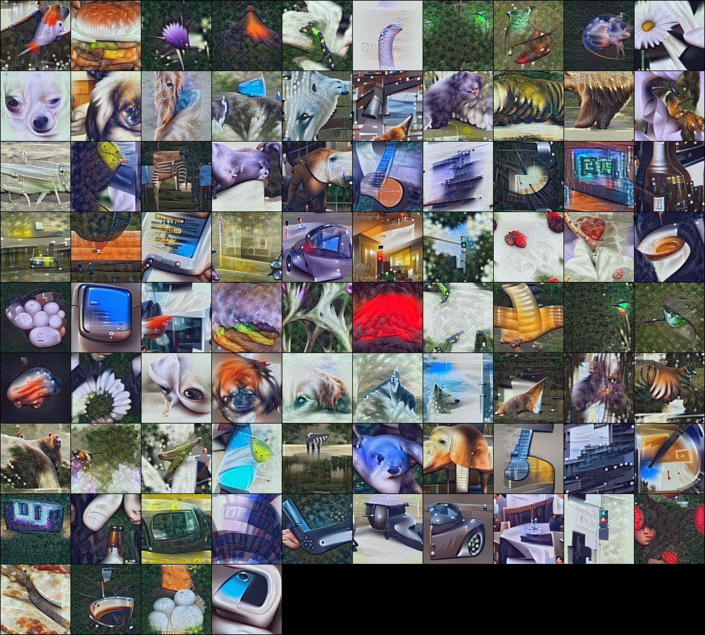

# Dreaming to Distill: Data-free Knowledge Transfer via DeepInversion

This repository is the official PyTorch implementation of [Dreaming to Distill: Data-free Knowledge Transfer via DeepInversion](https://arxiv.org/abs/1912.08795) presented at CVPR 2020.

The code will help to invert images from models of torchvision (pretrained on ImageNet), and run the images over another model to check generalization. We plan to update repo with CIFAR10 examples and teacher-student training.

Useful links: <br>
* [Camera Ready PDF](https://drive.google.com/file/d/1jg4o458y70aCqUPRklMEy6dOGlZ0qMde/view?usp=sharing) <br>
* [ArXiv Full](https://arxiv.org/pdf/1912.08795.pdf)<br>
* [Dataset - Synthesized ImageNet](https://drive.google.com/open?id=1AXCW6_E_Qtr5qyb9jygGaLub13gQo10c): from ResNet50v1.5, ~2GB, organized by classes, ~140k images. Were used in Section 4.4 (Data-free Knowledge Transfer), best viewed in gThumb.


## License

Copyright (C) 2020 NVIDIA Corporation. All rights reserved.

This work is made available under the Nvidia Source Code License (1-Way Commercial). To view a copy of this license, visit https://github.com/NVlabs/DeepInversion/blob/master/LICENSE

## Updates

- 2020 July 7. Added CIFAR10 inversion result for ResNet34 in the folder cifar10. Code on knowledge distillation will follow soon.
- 2020 June 16. Added a new scaling factor `first_bn_multiplier` for first BN layer. This improves fidelity.

## Requirements

Code was tested in virtual environment with Python 3.6. Install requirements:

```setup
pip install torch==1.4.0
pip install torchvision==0.5.0
pip install numpy
pip install Pillow
```

Additionally install APEX library for FP16 support (2x less memory, 2x faster): [Installing NVIDIA APEX](https://github.com/NVIDIA/apex#quick-start)

Provided code was originally designed to invert ResNet50v1.5 model trained for 90 epochs that achieves 77.26% top-1 on ImageNet. We are not able to share the model, but anyone can train it here: [ResNet50v1.5](https://github.com/NVIDIA/DeepLearningExamples/tree/master/PyTorch/Classification/ConvNets/resnet50v1.5).
Code works well for the default ResNet50 from torchvision package.

Code was tested on NVIDIA V100 GPU and Titan X Pascal.

## Running the code

This snippet will generate 84 images by inverting resnet50 model from torchvision package.

`python imagenet_inversion.py --bs=84 --do_flip --exp_name="rn50_inversion" --r_feature=0.01 --arch_name="resnet50" --verifier --adi_scale=0.0 --setting_id=0 --lr 0.25`

Arguments:

- `bs` - batch size, should be close to original batch size during training, but not necessary.
- `lr` - learning rate for the optimizer of input tensor for model inversion.
- `do_flip` - will do random flipping between iterations
- `exp_name` - name of the experiment, will create folder with this name in `./generations/` where intermediate generations will be stored after 100 iterations
- `r_feature` - coefficient for feature distribution regularization, might need adjustment for other networks
- `arch_name` - name of the network architecture, should be one of pretrained models from torch vision package: `resnet50`, `resnet18`, `mobilenet_v2` etc.
- `fp16` - enables FP16 training if needed, will use FP16 training via APEX AMP (O2 level)
- `verifier` - enables checking accuracy of generated images with another network (def `mobilenet_v2`) network after each 100 iterations.
Useful to observe generalizability of generated images.
- `setting_id` - settings for optimization: 0 - multi resolution scheme, 1 - 2k iterations full resolution, 2 - 20k iterations (the closes to ResNet50 experiments in the paper). Recommended to use setting_id={0, 1}
- `adi_scale` - competition coefficient. With positive value will lead to images that are good for the original model, but bad for verifier. Value 0.2 was used in the paper.
- `random_label` - randomly select classes for inversion. Without this argument the code will generate hand picked classes.

After 3k iterations (~6 mins on NVIDIA V100) generation is done: `Verifier accuracy:  91.6...%` (experiment with >98% verifier accuracy can be found `/example_logs`). We generated images by inverting vanilla ResNet50 (not trained for image generation) and classification accuracy by MobileNetv2 is >90%. A grid of images look like (from `/final_images/`, reduced quality due to JPEG compression. )


Optimization is sensitive to hyper-parameters. Try local tunings for your setups/applications. Try to change the r_feature coefficient, l2 regularization, betas of Adam optimizer (beta=0 work well). Keep looking at `loss_r_feature` as it indicates how close feature statistics are to the training distribution.

Reduce batch size if out of memory or without FP16 optimization. In the paper, we used batch size of 152, and larger batch size is preferred. This code will generate images from 41 hand picked classes. To randomize the target classes, simply use argument `--random_label`.

Examples of running code with different arguments and resulting images can be found at `/example_logs/`.

Check if you can invert other architectures, or even apply to other applications (keypoints, detection etc.).
Method has a room for improvement:
(a) improving the loss for feature regularization (we used MSE in paper but that may not be ideal for distribution matching),
(b) making it even faster,
(c) generating images for which multiple models are confident,
(d) increasing diversity.

Share your most exciting images at Twitter with hashtag [#Deepinversion](https://twitter.com/hashtag/deepinversion?src=hash) and [#DeepInvert](https://twitter.com/hashtag/DeepInvert?src=hashtag_click).  

## Citation

```bibtex
@inproceedings{yin2020dreaming,
	title = {Dreaming to Distill: Data-free Knowledge Transfer via DeepInversion},
	author = {Yin, Hongxu and Molchanov, Pavlo and Alvarez, Jose M. and Li, Zhizhong and Mallya, Arun and Hoiem, Derek and Jha, Niraj K and Kautz, Jan},
	booktitle = {The IEEE/CVF Conf. Computer Vision and Pattern Recognition (CVPR)},
	month = June,
	year = {2020}
}
```
