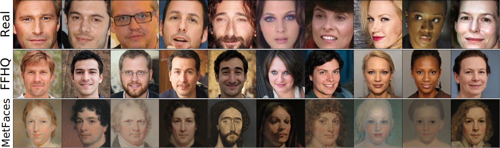
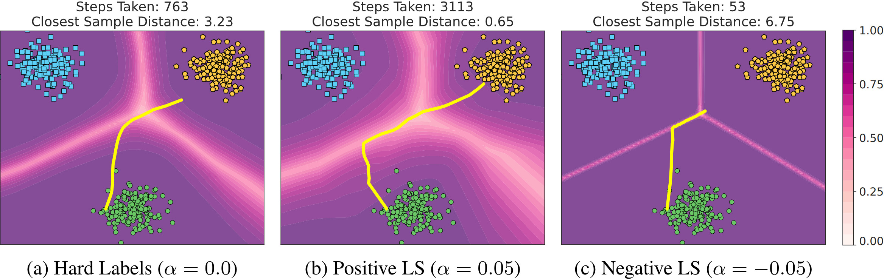
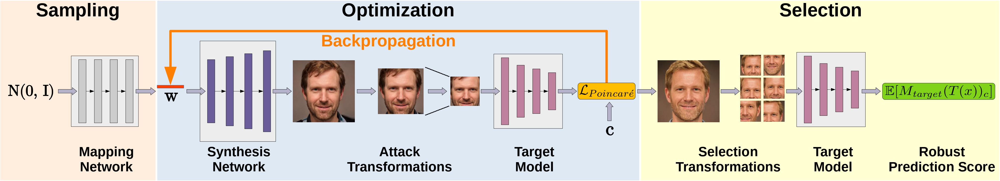

# _Plug & Play Attacks: Towards Robust and Flexible Model Inversion Attacks_ (ICML 2022)
  <center>
  
  </center>

> **Abstract:**
> *Model inversion attacks (MIAs) aim to create synthetic images that reflect the class-wise characteristics from a target classifier's private training data by exploiting the model's learned knowledge. Previous research has developed generative MIAs that use generative adversarial networks (GANs) as image priors tailored to a specific target model. This makes the attacks time- and resource-consuming, inflexible, and susceptible to distributional shifts between datasets. To overcome these drawbacks, we present Plug & Play Attacks, which relax the dependency between the target model and image prior, and enable the use of a single GAN to attack a wide range of targets, requiring only minor adjustments to the attack. Moreover, we show that powerful MIAs are possible even with publicly available pre-trained GANs and under strong distributional shifts, for which previous approaches fail to produce meaningful results. Our extensive evaluation confirms the improved robustness and flexibility of Plug & Play Attacks and their ability to create high-quality images revealing sensitive class characteristics.*  
[Full Paper (PDF)](https://arxiv.org/pdf/2201.12179.pdf)

# _Be Careful What You Smooth For: Label Smoothing Can Be a Privacy Shield but Also a Catalyst for Model Inversion Attacks_ (ICLR 2024)
  <center>
  
  </center>

> **Abstract:**
> *Label smoothing – using softened labels instead of hard ones – is a widely adopted regularization method for deep learning, showing diverse benefits such as enhanced generalization and calibration. Its implications for preserving model privacy, however, have remained unexplored. To fill this gap, we investigate the impact of label smoothing on model inversion attacks (MIAs), which aim to generate class-representative samples by exploiting the knowledge encoded in a classifier, thereby inferring sensitive information about its training data. Through extensive analyses, we uncover that traditional label smoothing fosters MIAs, thereby increasing a model's privacy leakage. Even more, we reveal that smoothing with negative factors counters this trend, impeding the extraction of class-related information and leading to privacy preservation, beating state-of-the-art defenses. This establishes a practical and powerful novel way for enhancing model resilience against MIAs.*  
[Full Paper (PDF)](https://arxiv.org/pdf/2310.06549.pdf)

## Model Inversion Attacks
  <center>
  
  </center>

Model inversion attacks (MIAs) intend to create synthetic images that reflect the characteristics of a specific class from a model's training data. For face recognition, the target model is trained to classify the identities of a set of people. An adversary without specific knowledge about the identities but with access to the trained model then tries to create synthetic facial images that share characteristic features with the targeted identities, such as gender, eye color, and facial shape. More intuitively, the adversary can be interpreted as a phantom sketch artist who aims to reconstruct faces based on the knowledge extracted from a target model.

# Changelog
- **January 18, 2024** Updated repository to add the code of ICLR paper "Be Careful What You Smooth For". The update includes support for label smoothing training, the knowledge extraction score, and various code improvements. We also added pre-trained weights of the ResNet-152 classifiers used in the paper.
- **October 12, 2023** Updated PyTorch version to 2.0 to improve speed and add support for additional features.
- **July 20, 2022** Added GPU memory requirements.
- **July 18, 2022** Updated BibTex with proceeding information.
- **June 22, 2022** We added a release containing the code and model weights used to perform the attacks and evaluation in our ICML paper. See the [default_attacking_local.yaml](configs/attacking/default_attacking_local.yaml) file on how to use local weight files. To use your own models, you need to extend [classifier.py](models/classifier.py) and, if necessary, [attack_config_parser.py](/utils/attack_config_parser.py) accordingly.


# Setup and Run Attacks

## GPU Memory Requirements
To provide a reference point for the GPU memory needed to perform the attacks, we measured the memory consumption for attacks against a ResNet-18 model trained on images with size 224x224. The memory consumption mainly depends on the batch size (BS), the target model size, and the StyleGAN2 model size. For our paper, we used V100-SXM3-32GB-H GPUs, but GPUs with smaller memory sizes are also sufficient.

| StyleGAN2 Resolution      | ResNet-18 (BS 20) | ResNet-18 (BS 10) | ResNet-18 (BS 1) |
| ----------- | ----------- | ----------------------- | ---------------- |
| 1024x1024   | 24.1 GB     | 15.8 GB                 | 3.2 GB           |
| 512x512     | 16.3 GB     | 10.8 GB                 | 2.7 GB           |
| 256x256     |  7.7 GB     |  5.1 GB                 | 2.1 GB           |

## Setup Docker Container
The easiest way to perform the attacks is to run the code in a Docker container. To build the Docker image run the following script:

```bash
docker build -t plug_and_play_attacks  .
```

Our Dockerfile also allows storing a Weights & Biases API key directly in the image. For this, provide the API key as an argument when building the image:
```bash
docker build -t plug_and_play_attacks --build-arg wandb_key=xxxxxxxxxx .
```

To create and start a Docker container run the following command from the project's root:

```bash
docker run --rm --shm-size 16G --name ppa --gpus '"device=0"' -v $(pwd):/workspace -it plug_and_play_attacks bash
```

To add additional GPUs, modify the option ```'"device=0,1,2"'``` accordingly. Detach from the container using ```Ctrl+P``` followed by ```Ctrl+Q```.


## Setup StyleGAN2
For using our attacks with StyleGAN2, clone the official [StyleGAN2-ADA-Pytorch](https://github.com/NVlabs/stylegan2-ada-pytorch) repo into the project's root folder and remove its git specific folders and files. 
```
git clone https://github.com/NVlabs/stylegan2-ada-pytorch.git
rm -r --force stylegan2-ada-pytorch/.git/
rm -r --force stylegan2-ada-pytorch/.github/
rm --force stylegan2-ada-pytorch/.gitignore
```

To download the pre-trained weights, run the following command from the project's root folder or copy the weights into ```stylegan2-ada-pytorch```:
```bash
wget https://nvlabs-fi-cdn.nvidia.com/stylegan2-ada-pytorch/pretrained/ffhq.pkl -P stylegan2-ada-pytorch/

```
NVIDIA provides the following pre-trained models: ```ffhq.pkl, metfaces.pkl, afhqcat.pkl, afhqdog.pkl, afhqwild.pkl, cifar10.pkl, brecahad.pkl```. Adjust the command above accordingly. For the training and resolution details, please visit the official repo.

## Setup Weights & Biases
We rely on Weights & Biases for experiment tracking and result storage. A free account is needed at [wandb.ai](https://wandb.ai/site) to track the experiments. Note that we do not have any commercial relationship with Weights & Biases. 

To connect your account to Weights & Biases, run the following command and add your API key:
```bash
wandb init
```
You can find the key at [wandb.ai/settings](https://wandb.ai/settings). After the key was added, stop the script with ```Ctrl+C```. 

Our Dockerfile also allows storing the API key directly in the image. For this, provide the key as an argument when building the image:
```bash
docker build -t plug_and_play_attacks --build-arg wandb_key=xxxxxxxxxx .
```


## Prepare Datasets
We support [FaceScrub](http://vintage.winklerbros.net/facescrub.html), [CelebA](https://mmlab.ie.cuhk.edu.hk/projects/CelebA.html) and [Stanford Dogs](http://vision.stanford.edu/aditya86/ImageNetDogs/) as datasets to train the target models. Please follow the instructions on the websites to download the datasets. Place all datasets in the folder ```data``` and make sure that the following structure is kept:

    .
    ├── data       
        ├── celeba
            ├── img_align_celeba
            ├── identity_CelebA.txt
            ├── list_attr_celeba.txt
            ├── list_bbox_celeba.txt
            ├── list_eval_partition.txt
            ├── list_landmarks_align_celeba.txt
            └── list_landmarks_celeba.txt
        ├── facescrub
            ├── actors
                ├── faces
                └── images
            └── actresses
                ├── faces
                └── images
        ├── stanford_dogs
            ├── Annotation
            ├── Images
            ├── file_list.mat
            ├── test_data.mat
            ├── test_list.mat
            ├── train_data.mat
            └── train_list.mat

For CelebA, we used a custom crop of the images using the [HD CelebA Cropper](https://github.com/LynnHo/HD-CelebA-Cropper) to increase the resolution of the cropped and aligned samples. We cropped the images using a face factor of 0.65 and resized them to size 224x224 with bicubic interpolation. The other parameters were left at default. Note that we only use the 1,000 identities with the most number of samples out of 10,177 available identities. 
            
## Train Target Models
Our code currently allows training all ResNet, ResNeSt, DenseNet, and Inception-v3 models stated at [pytorch.org/vision/stable/models](https://pytorch.org/vision/stable/models.html). To add support for other models, you need to modify the method ```_build_model``` in ```models/classifier.py```, add the new model, and adjust its output layer's size.

To define the model and training configuration, you need to create a configuration file. We provide a example configuration with explanations at ```configs/training/default_training.yaml```. To train the target models accordingly to our paper, we provide a training configuration for each dataset. You only need to adjust the architecture used and the Weights & Biases configuration - all other parameters are identical for each target dataset. Only the batch size has to be adjusted for larger models.

After a training configuration file has been created, run the following command to start the training with the specified configuration:
```bash
python train_model.py -c=configs/training/default_training.yaml
```
After the optimization is performed, the results are automatically evaluated. All results together with the initial, optimized, and selected latent vectors are stored at WandB.

__Note for training with label smoothing__: To train models with label smoothing regularization, simply adjust the ```label_smoothing``` parameter in the training config. If no parameter is specified, the smoothing factor is set to ```0.0```. For training with a negative smoothing factor, a scheduler is used by default to stabilize the training process. To use a custom scheduler, simply adjust the ```ls_scheduler``` function in ```train_model.py```.

## Perform Attacks
To perform our attacks, prepare an attack configuration file including the WandB run paths of the target and evaluation models. We provide an example configuration with explanations at ```configs/attacking/default_attacking.yaml```. We further provide configuration files to reproduce the various attack results stated in our paper. You only need to adjust the run paths for each dataset combination, and possibly the batch size.

After an attack configuration file has been created, run the following command to start the attack with the specified configuration:
```bash
python attack.py -c=configs/attacking/default_attacking.yaml
```

We also provide pre-trained model weights for the target and evaluation models with our GitHub Releases. Download the weight files to a local folder and adjust the model parameters accordingly, as demonstrated in ```configs/attacking/default_attacking_local.yaml```.

All results including the metrics will be stored at WandB for easy tracking and comparison.

## Compute Knowledge Extraction Score
We decided to exclude the knowledge extraction score from being automatically computed after the attack is finished due to the high additional computation time. Instead, training the student model to compute the score has to be manually started by running ```knowledge_extraction_score.py``` using the WandB run path of the finished attack.
```bash
python knowledge_extraction_score.py -r=username/model_inversion_attacks/xxxxxxxx -d=FaceScrub
```
The computed knowledge extraction scores are automatically stored in the WandB run summary.

## Citation
If you build upon our work, please don't forget to cite us.
```
@inproceedings{struppek2022ppa,
    title={Plug \& Play Attacks: Towards Robust and Flexible Model Inversion Attacks},
    author={Lukas Struppek and Dominik Hintersdorf and Antonio De Almeida Correia and Antonia Adler and Kristian Kersting},
    booktitle = {Proceedings of the 39th International Conference on Machine Learning (ICML)},
    pages = {20522--20545},
    series = {Proceedings of Machine Learning Research},
    publisher = {PMLR},
    year={2022}
}

@inproceedings{struppek24smoothing,
  author = {Lukas Struppek and Dominik Hintersdorf and Kristian Kersting},
  title = {Be Careful What You Smooth For: Label Smoothing Can Be a Privacy Shield but Also a Catalyst for Model Inversion Attacks},
  booktitle = {The Twelfth International Conference on Learning Representations (ICLR)},
  year = {2024},
}
```

## Implementation Credits
Some of our implementations rely on other repos. We want to thank the authors for making their code publicly available. 
For license details, refer to the corresponding files in our repo. For more details on the specific functionality, please visit the corresponding repos.
- FID Score: https://github.com/mseitzer/pytorch-fid
- Stanford Dogs Dataset Class: https://github.com/zrsmithson/Stanford-dogs
- FaceNet: https://github.com/timesler/facenet-pytorch
- Negative Label Smoothing: https://github.com/UCSC-REAL/negative-label-smoothing
